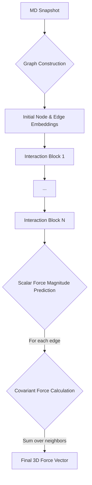

# GNN Force Field for Coarse-Grained Molecular Dynamics

[](https://opensource.org/licenses/MIT)
[](https://www.python.org/downloads/)
[](https://pytorch.org/)

A Graph Neural Network (GNN) framework for learning molecular dynamics force fields directly from trajectory data. This repository implements a model inspired by the **GNNFF** architecture to predict forces for a coarse-grained Polyethylene Oxide (PEO) system. The model is designed to be rotationally covariant, ensuring physical consistency.

## 🎯 Overview

This framework addresses the challenge of creating accurate and efficient force fields for molecular simulations by:

- **Learning from Data**: Directly learns interatomic forces from a pre-existing MD trajectory.
- **Enforcing Physics**: Implements a rotationally covariant architecture that separates force magnitude and direction.
- **Automating Feature Engineering**: Uses a graph representation and message passing to automatically learn features of the local atomic environment.
- **Ensuring Stability**: Incorporates automated data filtering and normalization to handle noisy, real-world simulation data.

### Key Innovation

The model's architecture, inspired by GNNFF, uniquely combines:
1.  **Graph Representation** → Encodes molecular structure, including covalent bonds and spatial neighbors.
2.  **Gaussian Basis Edge Embeddings** → Creates a rich representation of interatomic distances.
3.  **Iterative Message Passing** → Refines both atom and interaction (edge) representations.
4.  **Covariant Force Calculation** → Predicts a scalar force magnitude for each interaction and combines it with a direction vector, guaranteeing rotational covariance.

## 🚀 Features

### ✨ Core Capabilities
- **Direct Force Prediction**: Bypasses the potential energy surface for efficient force evaluation.
- **Data-Driven Potential**: Learns complex many-body interactions directly from data.
- **Scalable**: The local environment approach allows the model to be applied to systems of varying sizes.
- **Automated Data Cleaning**: Dynamically filters high-force outliers to improve training stability.

### 🔬 Scientific Features
- **Rotationally Covariant by Construction**: Guarantees that forces rotate correctly with the physical system.
- **Hybrid Graph Edges**: Explicitly encodes both the covalent backbone and non-bonded spatial interactions.
- **Learned Edge States**: The model updates its representation of interactions (edges), not just atoms.

### 🛠️ Technical Features
- **Modular Design**: Code is cleanly separated into configuration, data preparation, model, and training modules.
- **PyTorch Geometric Backend**: Built on a standard, high-performance GNN library.
- **Hyperparameter Management**: All key parameters are centralized in `config.py` for easy tuning.
- **Early Stopping**: Automatically saves the best model and prevents overfitting.

## 📋 Requirements

### System Requirements
- **Python**: 3.8 or higher
- **GPU**: NVIDIA GPU with CUDA support (recommended for faster training)
- **Memory**: Minimum 8GB RAM

### Dependencies
Install all dependencies using the provided `requirements.txt` file.
```
# Core dependencies
pandas
numpy
torch
torch_geometric
torch-cluster
scikit-learn
matplotlib
```

## 🔧 Installation

```bash
# Clone the repository
git clone [https://github.com/BBahtiri/gnn-cg-peo-forcefield.git](https://github.com/BBahtiri/gnn-cg-peo-forcefield.git)
cd gnn-cg-peo-forcefield

# Create a virtual environment (recommended)
python -m venv gnn_env
source gnn_env/bin/activate  # On Windows: gnn_env\Scripts\activate

# Install dependencies (use the command matching your PyTorch/CUDA version)
# See [https://pytorch-geometric.readthedocs.io/en/latest/install/installation.html](https://pytorch-geometric.readthedocs.io/en/latest/install/installation.html)
# Example for PyTorch 2.3+ and CPU:
pip install torch_geometric torch-cluster -f [https://data.pyg.org/whl/torch-2.3.0+cpu.html](https://data.pyg.org/whl/torch-2.3.0+cpu.html)

# Install remaining packages
pip install pandas numpy scikit-learn matplotlib
```

## 📁 Project Structure

```
gnn-cg-peo-forcefield/
├── 📄 main.py               # Main script to run the entire pipeline
├── 📄 config.py             # All hyperparameters and configuration settings
├── 🧠 model.py               # GNN model architecture (GNNForceField)
├── 📊 data_prepare.py       # Data loading, filtering, and graph construction
├── ⚙️ training.py           # Training loop, evaluation, and plotting functions
├── 📄 requirements.txt      # Python dependencies
└── 📄 README.md             # This file
```

## 🏃‍♂️ Quick Start

### 1. Configure Your Project
Open `config.py` and modify the parameters as needed. At a minimum, ensure `FILE_PATH` is correct.

```python
# In config.py
# --- Data ---
FILE_PATH = r"C:\Users\betim\Documents\gnn_cg_peo\peo50_cg_trajectory.dat"

# --- Model ---
HIDDEN_DIM = 128
NUM_LAYERS = 4

# --- Training ---
LEARNING_RATE = 5e-4
EPOCHS = 1000
```

### 2. Run Training
Execute the main script from your terminal.

```bash
python main.py
```

### 3. Monitor Results
The script will print its progress to the console. Upon completion, it will:
- Print the final **Test Set RMSE**.
- Display a **Training vs. Validation Loss** plot.
- Display a **Parity Plot** comparing true and predicted forces.
- Save the best-performing model weights to `best_model.pth`.

## 🧠 Model Architecture

### Overall Framework


### Key Components

#### 1. Graph Construction
Each MD frame is converted to a graph where beads are **nodes** and interactions are **edges**. Node features are one-hot encoded types (`first`, `middle`, `last`). Edges represent both **covalent bonds** and non-bonded neighbors within a **cutoff radius**.

#### 2. Gaussian Edge Embeddings
The scalar distance $d_{ij}$ for each edge is expanded into a rich feature vector using a Gaussian basis filter, creating an initial edge embedding $h_{(i,j)}^0$.

#### 3. Interaction Blocks (Message Passing)
The model uses a stack of interaction blocks that iteratively update the hidden states of both **nodes** ($h_i$) and **edges** ($h_{(i,j)}$). This allows the model to learn complex representations of both the atoms and their interactions.

#### 4. Covariant Force Calculation
The final updated edge embedding $h_{(i,j)}^L$ is used to predict a **scalar force magnitude** $n_{ij}$. This scalar is then projected back into a 3D vector using the direction unit vector $\vec{u}_{ij}$. The total force on an atom $j$ is the sum of these vector contributions from its neighbors, ensuring rotational covariance.
```math
\vec{F}_{j}=\sum_{i\in N_{j}}n_{ij}\vec{u}_{ij}
```

## 📈 Evaluation and Visualization

The training script automatically evaluates the model and generates two key plots:
1.  **Loss Curve**: Shows the Mean Squared Error for training and validation sets over epochs. This helps diagnose overfitting.
2.  **Parity Plot**: A scatter plot of predicted forces vs. true forces. A perfect model would have all points on the y=x line.

## 📚 Citation

This work is an implementation of ideas presented in the GNNFF paper. If you use this code in your research, please consider citing the original work:

```bibtex
@article{park2021accurate,
  title={Accurate and scalable graph neural network force field and molecular dynamics with direct force architecture},
  author={Park, Cheol Woo and Kornbluth, Mordechai and Vandermause, Jonathan and Wolverton, Chris and Kozinsky, Boris and Mailoa, Jonathan P},
  journal={npj Computational Materials},
  volume={7},
  number={1},
  pages={73},
  year={2021},
  publisher={Nature Publishing Group}
}
```

## 🐛 Troubleshooting

### Common Issues

- **`ImportError: 'radius_graph' requires 'torch-cluster'`**: The PyG dependencies were not installed correctly. Use the specific installation command from the PyG website that matches your PyTorch/CUDA version.
- **Overfitting (Validation loss increases)**: Try increasing `WEIGHT_DECAY`, decreasing `LEARNING_RATE`, or reducing model complexity (`HIDDEN_DIM`, `NUM_LAYERS`) in `config.py`.
- **Slow Training**: Reduce `HIDDEN_DIM` or `NUM_LAYERS` for a smaller model. Ensure you are using a GPU if available.

### Getting Help
- 🐛 **Issues**: [https://github.com/BBahtiri/gnn-cg-peo-forcefield/issues](https://github.com/BBahtiri/gnn-cg-peo-forcefield/issues)
- 💬 **Discussions**: [https://github.com/BBahtiri/gnn-cg-peo-forcefield/discussions](https://github.com/BBahtiri/gnn-cg-peo-forcefield/discussions)
